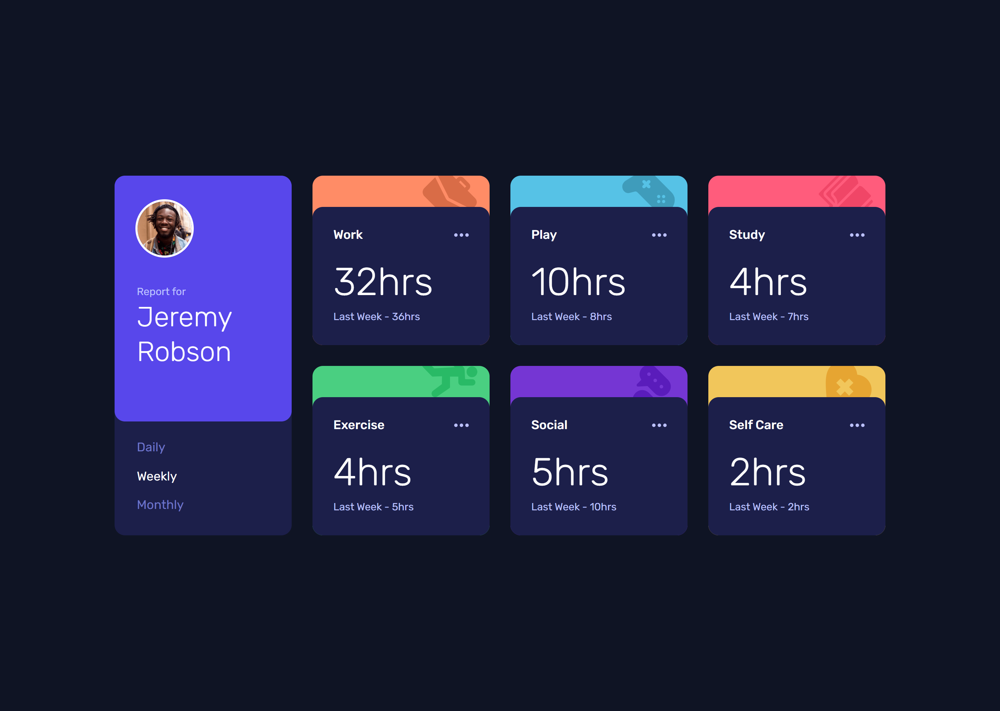

# Frontend Mentor - Time tracking dashboard solution

This is a solution to the [Time tracking dashboard challenge on Frontend Mentor](https://www.frontendmentor.io/challenges/time-tracking-dashboard-UIQ7167Jw). Frontend Mentor challenges help you improve your coding skills by building realistic projects.

## Table of contents

- [Overview](#overview)
  - [The challenge](#the-challenge)
  - [Screenshot](#screenshot)
  - [Links](#links)
- [My process](#my-process)
  - [Built with](#built-with)
  - [What I learned](#what-i-learned)
  - [Continued development](#continued-development)
  - [Useful resources](#useful-resources)
- [Author](#author)
- [Acknowledgments](#acknowledgments)

**Note: Delete this note and update the table of contents based on what sections you keep.**

## Overview

### The challenge

Users should be able to:

- View the optimal layout for the site depending on their device's screen size
- See hover states for all interactive elements on the page
- Switch between viewing Daily, Weekly, and Monthly stats

### Screenshot

### Links

- Solution URL: [solution URL](https://www.frontendmentor.io/solutions/time-tracking-dashboard-with-html-sass-and-javascriptasync-await-zbZLlwfE2-)
- Live Site URL: [My live](https://jomagene.github.io/time-tracking-dashboard/)

## My process

### Built with

- Semantic HTML5 markup
- CSS custom properties
- Sass / SCSS
- Flexbox
- CSS Grid
- Mobile-first workflow

### What I learned

I also gained experience in using JavaScript to fetch and manipulate JSON data, ensuring the dashboard updates dynamically based on user interaction.

### Continued development

In future projects, I aim to refine my understanding of advanced JavaScript concepts, particularly in managing state and optimizing performance.

### Useful resources

- [CSS-Tricks: A Complete Guide to Grid](https://css-tricks.com/snippets/css/complete-guide-grid/) - This guide was instrumental in helping me understand CSS Grid, which I used extensively in this project.
- [MDN Web Docs: Fetch API](https://developer.mozilla.org/en-US/docs/Web/API/Fetch_API) - This resource helped me implement the fetch functionality to load data dynamically.

## Author

- Frontend Mentor - [@Jomagene](https://www.frontendmentor.io/profile/Jomagene)
- Twitter - [@Jomagene](https://www.twitter.com/Jomagene)

## Acknowledgments

I want to thank the Frontend Mentor community for their invaluable feedback and guidance throughout this project. Their support helped me improve the quality of my solution and learn new techniques.
